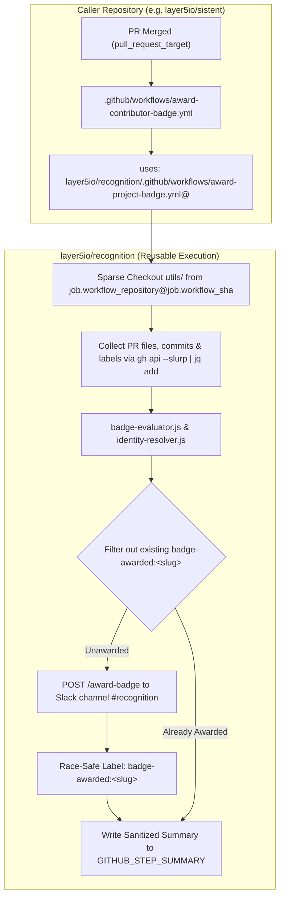

# Track 2: Project Contribution PR Merges Badge Automation

Automated contributor badge assignments upon Pull Request merges across Layer5 and Meshery repositories, hardened with award-level duplicate mitigation, race-safe label creation, PR-level concurrency guards, and executed via GitHub's native reusable workflow job context.

Part of the **Layer5 Recognition System** ([Issue #116](https://github.com/layer5io/recognition/issues/116)).

---

## 1. Overview & Scope

Track 2 automates immediate contributor recognition for merged Pull Requests across participating ecosystem repositories. It evaluates PRs against declarative rules for the **8 authoritative project-specific badges**, verifies contributor attribution and DCO compliance, dispatches award commands, and records tracking labels on the merged PR for idempotency.

### The 8 Authoritative Badges

| Badge Slug | Official Title | Scope & Target Repositories | Heuristic & Qualifying Files | False-Positive Exclusion Guards |
| :--- | :--- | :--- | :--- | :--- |
| `sistent-contributor` | **Sistent Contributor** | `layer5io/sistent` | Modifies `src/**`, `packages/**`, `system/**`, `examples/**`, `scripts/**`, or build targets (`package.json`, `tsconfig.json`, `Makefile`). | Excludes non-code metadata (`.github/**`, `.gitignore`, `LICENSE`, `CODE_OF_CONDUCT.md`, `README.md`, `CONTRIBUTING*.md`, `MAINTAINERS.md`). |
| `meshery` | **Meshery** | `meshery/meshery` | Modifies core functional codebase (`server/**`, `mesheryctl/**`, `models/**`, `install/**`, `ui/**`, `provider-ui/**`, `main.go`, `Makefile`, `go.mod`, `go.sum`). | Excludes PRs modifying only documentation (`docs/**` earns `meshery-docs`), root markdown/governance (`README.md`, `ROADMAP.md`, `ADOPTERS.md`, `GOVERNANCE.md`, `VISION*.md`, `CONTRIBUTING*.md`), or `.github/**`. |
| `meshery-operator` | **Meshery Operator** | `meshery/meshery-operator` | Modifies operator controllers/APIs (`controllers/**`, `api/**`, `pkg/**`, `bundle/**`, `config/**`, `main.go`, `Makefile`, `go.mod`, `go.sum`). | Excludes root non-code metadata (`.github/**`, `LICENSE`, `README.md`, `CODE_OF_CONDUCT.md`). |
| `meshsync` | **MeshSync** | `meshery/meshsync` | Modifies MeshSync daemon logic (`internal/**`, `pkg/**`, `plugins/**`, `cache/**`, `main.go`, `Makefile`, `go.mod`, `go.sum`). | Excludes root non-code metadata (`.github/**`, `LICENSE`, `README.md`, `CODE_OF_CONDUCT.md`). |
| `meshery-docs` | **Meshery Docs** | `meshery/meshery`, `layer5io/docs` | Modifies documentation paths (`docs/**` in Meshery, `content/**`, `pages/**` in Layer5 Docs). | Generic `**/*.md` is forbidden; strictly scoped to verified documentation trees. |
| `meshery-catalog` | **Meshery Catalog** | `meshery/meshery.io`, `meshery/meshery` | Modifies catalog items (`catalog/**`, `collections/catalog/**` in Meshery.io, `models/**` in Meshery). | Excludes non-catalog site assets and generic docs. |
| `landscape` | **Landscape** | `layer5io/layer5` | Modifies landscape data (`src/collections/landscape/**`). | Strictly scoped to landscape collection. Excludes blog, news, and member collections. |
| `ui-ux` | **UI/UX** | `meshery/meshery`, `layer5io/sistent`, `layer5io/layer5` | Requires label `area/ui` or `area/ux` AND modifications in frontend components (`ui/**`, `provider-ui/**`, `src/**`, `system/**`, `examples/**`, `src/components/**`, `src/sections/**`, `src/templates/**`, `src/pages/**`). | Excludes unit tests (`**/*.test.*`, `**/*.spec.*`, `**/__tests__/**`), lockfiles, and non-frontend packages. |

---

## 2. Architecture & Security Model



### Zero Untrusted Code Execution & Permissions
1. **Privileged Base Context & Defense-in-Depth**: Caller workflows execute via `pull_request_target: types: [closed]` where `github.event.pull_request.merged == true`. Fork PR code is **never** checked out. As defense-in-depth, the reusable workflow independently queries the GitHub API to verify the PR exists and is actually merged before evaluating badges or dispatching awards.
2. **Authorized Repository Allowlist**: The reusable workflow validates that the calling repository is an authorized Track 2 participating repository (`layer5io/sistent`, `meshery/meshery`, `meshery/meshery-operator`, `meshery/meshsync`, `layer5io/docs`, `meshery/meshery.io`, `layer5io/layer5`). Unlisted repositories fail closed.
3. **Minimal Permissions**: The workflow operates strictly with:
   ```yaml
   permissions:
     contents: read
     issues: write
   ```
   PR labels are manipulated exclusively via the GitHub Issues API (`/repos/{owner}/{repo}/issues/{number}/labels`). No write access to pull-requests or code contents is granted.
3. **Strict Trusted Engine Checkout**: The runner checks out code using the immutable job context:
   ```yaml
   - name: Checkout trusted recognition engine
     uses: actions/checkout@11bd71901bbe5b1630ceea73d27597364c9af683 # v4.2.2 pinned SHA
     with:
       repository: ${{ job.workflow_repository }}
       ref: ${{ job.workflow_sha }}
       path: .recognition-engine
       sparse-checkout: |
         utils
   ```
   There are no silent fallbacks to other branches or repositories; if the reusable workflow context is unavailable, execution fails closed.
4. **Trusted Slack Channel**: Award commands are dispatched strictly to the canonical recognition channel (`CLDRKJZ0T`). Callers cannot redirect tokens to arbitrary channels.
5. **Caller Targeting**: All GitHub API and CLI operations explicitly target `TARGET_REPO="${{ github.repository }}"` and `PR_NUMBER="${{ inputs.pr_number }}"`.

---

## 3. Privacy & Email Sanitization

Contributor emails are treated as sensitive data:
- **Zero Plaintext Email Logging**: Plaintext email addresses are **never** printed to runner stdout, console logs, error messages, or `$GITHUB_STEP_SUMMARY`.
- **Masked Identity Display**: Public reports and Step Summaries display only obfuscated emails (e.g. `c***b@layer5.io`) or GitHub handles (`@contributor`).
- **Ephemeral Dispatch Isolation**: The plaintext email is passed only into the ephemeral dispatch environment strictly to construct the Slack API payload, after which the dispatch file is immediately wiped.

---

## 4. Concurrency, Idempotency & Retry Model

### 4.1 Per-PR Concurrency Guard
```yaml
concurrency:
  group: badge-award-${{ github.repository }}-${{ inputs.pr_number }}
  cancel-in-progress: false
```
`cancel-in-progress: false` ensures that any active execution completes its award-and-label cycle before another run begins.

### 4.2 Idempotency Semantics & Partial Recovery
The system implements **concurrency protection + per-badge tracking + at-least-once external dispatch**:
- Awarding executes sequentially per badge:
  $$\text{1. Slack Dispatch } (/award-badge) \longrightarrow \text{2. GitHub Tracking Label Write } (badge-awarded:<slug>)$$
- If badge 1 is awarded and labeled, but badge 2 fails during dispatch:
  - The workflow run fails.
  - Upon rerun, badge 1 is skipped (its label exists), and only badge 2 is dispatched.
- **Race-Safe Labeling**: Calling `POST /repos/${TARGET_REPO}/labels` inspects HTTP responses:
  - `201 Created`: Success.
  - `422 Validation Failed`: If and only if `code: "already_exists"`, it is treated as success.
  - Any other error (401/403/5xx): Fails fatally.

---

## 5. Contributor Attribution & DCO Verification

Attribution strictly requires:
```text
PR author
→ GitHub-associated commit author matching PR author (strictly commit.author.login === prAuthor)
→ DCO Signed-off-by trailer attributable to that commit author
→ verified RFC-compliant email
```
- No fallback to `committer.login`.
- If multiple `Signed-off-by` trailers exist (e.g. contributor + maintainer), the trailer matching the commit author's git email/name is selected.
- All commits by the author in the PR must resolve to the same verified email. Any ambiguity fails closed.

---

## 6. Local Development & Testing

### Running Unit Tests
```bash
npm run test:badge-engine
# Or directly via Node.js native test runner
node --test utils/*.test.js
```

### Dry-Run Testing of Historical PRs
Maintainers can safely evaluate historical PRs using `.github/workflows/test-badge-evaluator.yml`:
1. Open **Actions** $\rightarrow$ **Test Badge Evaluator (Dry-Run)** in `layer5io/recognition`.
2. Enter the target `repository` (e.g. `layer5io/sistent` or `meshery/meshery`) and `pr_number`.
3. Review the sanitized Step Summary and console output.

---

## 7. Onboarding Caller Repositories (Phases 2 & 3)

To onboard a repository (e.g. `layer5io/sistent`), add `.github/workflows/award-contributor-badge.yml`:

```yaml
name: Award Contributor Badges

on:
  pull_request_target:
    types: [closed]

permissions:
  contents: read
  issues: write

jobs:
  award:
    name: Process Merged PR Badges
    if: github.event.pull_request.merged == true
    uses: layer5io/recognition/.github/workflows/award-project-badge.yml@<PINNED_SHA>
    with:
      pr_number: ${{ github.event.pull_request.number }}
    secrets:
      SLACK_BOT_TOKEN: ${{ secrets.SLACK_BOT_TOKEN }}
```
